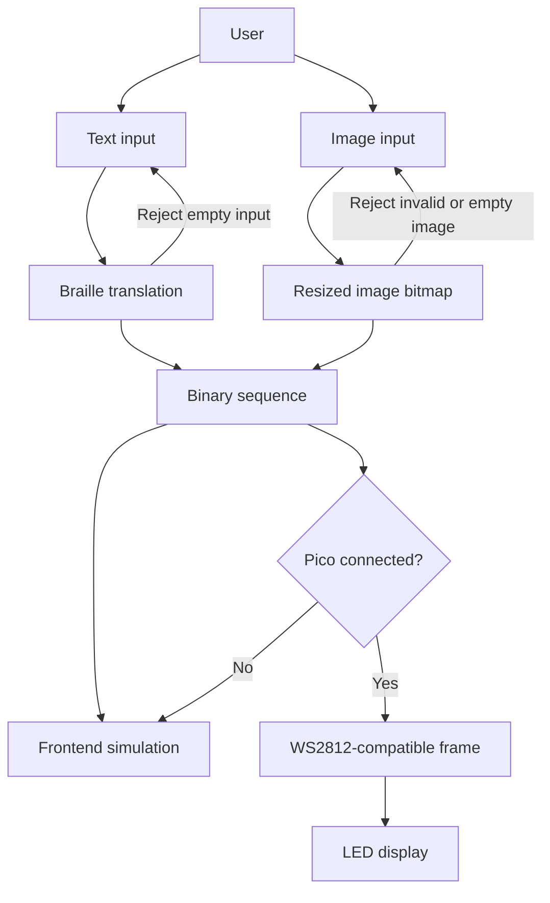

#Tactile Pad - Final Report
## 1. Team Information
- **Team Name:** TechTile
- **Team Members:**
  - Neha Kalakuntla (nehakalakuntla@brandeis.edu)
  - Aimuan Erhabor (aimuanerhabor@brandeis.edu)
  - Jojo Day (jojoday@brandeis.edu)
  - Elise Keller (elisekeller@brandeis.edu)
  - Jiayi Zhang (jzhang1166@brandeis.edu)
- **Github Repository:** https://github.com/sd1166/Tactile-Pad-Project

- **Demo link**:

## 2. Abstract

Blind and visually impaired individuals face significant economic barriers to accessing information, as current assistive tactile displays range in price from $2,000 to over $50,000. This project proposes a refreshable tactile display designed to be an affordable, DIY alternative for sensing images by translating digital text and simple visual representations into physical tactile patterns. Utilizing a Raspberry Pi Pico and LED strips, the device will represent what a grid of pins that could be raised to provide a tactile representation of maps and images. The goal is to create a representation of what a functional, scalable prototype that can represent a lower-cost solution for navigation, education, and entertainment. 

The primary goal of the project was to present a cheaper alternative of a refreshable braille display with electromechanical braille modules but due to restraints, LED strips were used instead. We have created a successful LED representation of a braille display and code that 
can translate text to braille and binary mapped images and send them to compatible braille representation devices. 


## 3. Project Details
This section describes the overall design and implementation of the Tactile Pad, including its mechanical structure, hardware control components, software processing pipeline, and system control flow.

### 3.1 Project Description
This project is a python web app built on Flask that processes braille translation and image binarization that is sent as either a simulation of braille display or LED representation of such. With an user interface, the web app can handle requests and responses, the Web app utilizes HTTP and JSON API to handle communication with the backend with the interface. If there is a compatible LED display linked to the computer running the web app, it can also send the braille translation of inputted text or compatible binarized image to the LED display. 
### 3.2 Hardware Components
| Component | Description | Quantity |
|---------|-------------|----------|
| Raspberry Pi pico w | LED controller | 1 |
| Raspberry Pi | Server | 1 |
| 32 x 8 LED strip| represent text to braille module| 1 |
| 16 x 16 LED strip | represent image to binary image module| 1 |
| Button | tactile interface with braille display| 2 |
### 3.3 Software Components
- Libraries / Frameworks:

This python project uses a standard library for braille translation and a custom text and image processing module for converting text and images into binary matrices. Our main web stack is Flask which handles the HTTP routing, JSON APIs, template rendering, and serving uploads and files. Pillow was used for image processing. PySerial was used to handle data transfer over the serial port. Mpremote was used to push micropython files into connected Pico.

- Software structure:

```text
Tactile-Pad-Project/
├── app.py
├── pyproject.toml
├── README.md
├── requirements.txt
├── deploy/
│   ├── tactile.env
│   ├── tactile.env.example
│   └── tactile.service
├── pico/
│   ├── hw_smoke_ws2812.py
│   ├── pico_ws2812_receiver.py
│   ├── serial_receiver.py
│   ├── pico_server.py
│   ├── pico_LED_braille.py
│   ├── LED_board.py
│   └── led_test.py
├── scripts/
│   ├── mac_board_bridge.py
│   ├── serial_test.py
│   └── ws2812_diag.py
├── src/
│   └── tactile/
│       ├── __init__.py
│       ├── __main__.py
│       ├── app.py
│       ├── board_transport.py
│       ├── braille.py
│       ├── image_pipeline.py
│       ├── serial_board.py
│       ├── ws2812_matrix.py
│       └── ws2812_serial_board.py
├── static/
│   └── style.css
├── templates/
│   └── index.html
└── uploads/
```

- Data flow

  ```mermaid
  flowchart LR
      A[Browser UI] -->|HTTP / JSON| B[Flask server]
      B --> C[Translate & encode]
      C --> D[Byte sequence]
      D --> E[USB serial]
      E -->|ASCII lines + Base64| F[Pico]
      F -->|WS2812 / NeoPixel| G[LED panels]
  ```

  The user enters text or uploads an image in the browser. The browser sends HTTP requests to the Flask server (typically on a Raspberry Pi), which performs text-to-Braille translation and image processing and returns data for on-screen preview. To drive the physical matrix, the backend sends encoded frames to the Raspberry Pi Pico over USB serial from whichever machine has the Pico plugged in—either the Pi directly or, when using a bridge, another host such as a Mac. The Pico firmware then drives the LEDs using the WS2812 (NeoPixel) protocol on the data line.

- User interface:

	Webpage which takes in user input. There are 2 main top-level tabs; the first one is a controller which renders on the physical LED board and second is a simulator which visualizes the project at various scales. Both tabs include the functionality of taking in text or image input and shows a preview of the conversion. Text to braille conversion also details the character type and translation. Additionally the webpage includes simple functionalities such as clear, reset, summarize, and continue text for longer input.

- Communication Protocols (e.g., I2C, SPI, MQTT):
    - HTTP: client- server communication
    - TCP: data transport over wifi, underlies HTTP
    - USB serial(UART): data transfer from client to pico
	- WS2812: real-time control of LED board, pico to LED boards
### 3.4 Overall Control Flow

First, the user provides input through the web interface, either by entering text or uploading an image. The frontend application sends this input to the processing module. 

Next, the processing module converts the input into a binary grid representation. For text input, characters are mapped to predefined braille patterns. For images, the system performs resizing, grayscale conversion, and thresholding to generate a binary matrix.

The generated binary data is then formatted and transmitted to the Raspberry Pi Pico via USB serial communication.

Upon receiving the data, the microcontroller interprets the binary values and sends control signals to the connected output device. In the current implementation, the LED panel displays the binary pattern, simulating the tactile output.




## 4. Challenges and Limitations
- Technical challenges

One of the biggest technical challenges we faced was navigating concepts foreign to us like soldering PCBs, circuit designs, and creating hardware pieces in general. The configurations of how these individual components integrate with each other and building the architecture of this complex system was on a bigger scale compared to prior projects. Additionally, due to the miniscule size of the braille module we were using and the fragility of the electromagnets we crafted, creating these components specifically posed a challenge itself. In regards to using LED panels to represent the tactile representation, the serpentine row patterning was an issue for the software to send the correct braille patterns to display on the LED.

- Design constraints

With the LED representation, we were limited to 8 by 32 display for the braille display and 16 by 16 binary image map display. The braille strip ratio does not match the 3 by 2 cell representation perfectly, so we had to alter the code to navigate that issue. The LED lights in general did not match the scale of the pins that a braille person would use read from; bigger than what is expected. 

- What didn’t work as expected

One of the most significant issues that we encountered and had to accept was the challenge and limited time to create customized electromechanical braille modules. Due to the time of preparing the materials and assembling them, we were unable to reach a functional braille module. However, we pivoted to LED boards to showcase the software which would function the same as the modules. With the LED representation, we were limited to only being able to display either braille or image conversion at a time, which would have been put on the same circuit board with the physical braille modules. We also did not have the time to implement a button that could serve as an additional functionality for a user to control the board.

- Potential enhancements

Some potential enhancements to our project would be to fully adapt the text and image visualization simultaneously. This could be implemented in both the LED boards and braille modules. Another enhancement would be having a tactile button interface which allows the user to control the tactile board through the pico itself rather than through the app. Additionally, adding a database to cache frequently used images and texts would reduce redundant computation on the Pi, allowing repeated inputs to be served as a simple data fetch rather than reprocessing.

- Features we would add with more time

With more time, we would expand the system to support additional LED display formats, allowing for greater flexibility in resolution, layout, and scalability across different hardware configurations. We would also unify the display func	tionality so that the image panel could be used as a braille display, enabling a single system to handle both text and image outputs more seamlessly. Finally, we would improve the accessibility of the website itself by refining the UI for screen readers, enhancing navigation, and ensuring the interface better supports the needs of visually impaired users.

## 5. Demo Description
- How the system works in real time

The demo begins by showcasing the main controller interface, where the system operates in real time. In text mode, the user inputs text, which is immediately processed and displayed both in the UI and on the physical 32x8 LED panel. The UI provides both a detailed braille view that shows the binary representation and character type, as well as a simple line view that mirrors exactly what is displayed on the LED panel. Multiple inputs of varying lengths are tested to demonstrate how the system handles longer text, using a “Continue Text” button in the UI to cycle through additional characters beyond the 22-character limit of the panel. The demo then transitions to image mode, where the 16x16 panel is shown as images are uploaded and converted into binary representations, lighting up the panel to reflect the processed output.

The next portion of the demo focuses on a screen recording of the simulation tab within the UI. Here, users can scale the number of braille characters displayed, input text, and observe how it would appear across different configurations without requiring hardware. In image mode, users can similarly adjust the number of pins used to represent the image and upload multiple images to test different display configurations.

- Key highlights

The demo highlights the flexibility of the system across both hardware and software. The main controller demonstrates real-time interaction with physical LED panels, showing both text-to-braille translation and image-based outputs. The simulation tab further extends this by allowing users to scale the number of braille characters displayed and adjust the size of the virtual board, making it possible to visualize outputs without hardware constraints. In both text and image modes, multiple inputs are tested to show consistency and adaptability, emphasizing the system’s ability to handle different input sizes and display configurations.

## 6. Contributions
**Jiayi Zhang**
  - Designed and implemented the image-to-tactile mapping module.
  - Built image preprocessing functions, including resizing and threshold binarization.
  - Added image upload and tactile preview support in the frontend.
  - Integrated the module into the updated UI and tested with sample images.

**Aimuan Erhabor**
- Assisted with research into materials and methodologies
- Assisted with the development of coiling machine with 3D printing and design revision
- Designed and created first LED representation braille module
- Designed firmware to express braille characters through LED module tests
- Tested LED panels capabilities with existing software
- Made adjustments to text and image communication


**Jojo Day**
- Assisted with research into materials and methodologies
- Assisted with the design revision of coiling machine
- Sourcing hardware materials
- 3D Fabrication of braille modules in collaboration with Makerlab
- Raspberry Pi configuration

**Elise Keller**
- Implemented Braille to Text Translation
- Implemented Visual Simulation of Braille Translation
- Designed Software Stack and implemented Web app 
- Designed functional UI 
- Implemented LED panel display for text and image output 
- Recorded and edited demo


**Neha Kalakuntla**
- Assisted with research into materials and methodologies
- Modified schematic, PCB files, and CAD files 
- Assisted with integrating all components together

## 7.Conclusion
- What we built

We have designed a LED representation of what a braille tactile display could operate as. We have designed a web app that can communicate with a LED display which can represent text-to braille and binarized images. 

- What we learned

Individually, we all have learnt new technologies and techniques relevant to each of our specific roles and involvements in the project. We have learnt how to do 3d modeling, 3d printing, PCB design, circuit design, serial communication and image processing. We learn to design our own API and protocols to adapt to the specific architecture we had at the time. Collaboratively, we have learnt the interactions between software, hardware and firmware in between.  In terms of soft skills, we have learnt the importance of communication, planning and workload sharing as the project evolved throughout the semester. 


- Overall success of the project

We made a fully functional application to serve requests to be rendered on physical hardware, highlighting the real potential of having an refreshable tactile pad. The completed project showcases how a tactile pad could be realized given more resources in hardware components, time, and experience in electronics engineering. With completed braille modules, the software is easily modifiable to fit the sourced circuit boards 

## References
- Inspiration Project: [Electromechanical Refreshable Braille Module](https://hackaday.io/project/191181-electromechanical-refreshable-braille-module)
- Research papers
  - [MagnePins](https://dl.acm.org/doi/10.1145/3746059.3747692)
  - [Shape Clip](https://dl.acm.org/doi/10.1145/2702123.2702599)
  - [Haptic Edge Display for Mobile Tactile Interaction](https://dl.acm.org/doi/abs/10.1145/2858036.2858264)
  - [Tilt Displays](https://dl.acm.org/doi/10.1145/2371574.2371600)
  - [MagTics](https://dl.acm.org/doi/10.1145/3126594.3126609)
- On the market:
  - [Dot Pad X](https://www.dotincorp.com/en/product/dotpadx)
  - [Monarch](https://www.aph.org/product/monarch/)
  - [Braille Pad En](https://www.4blind.com/braillepad-en)
  - [Graphiti](http://www.orbitresearch.com/product/graphiti/)
